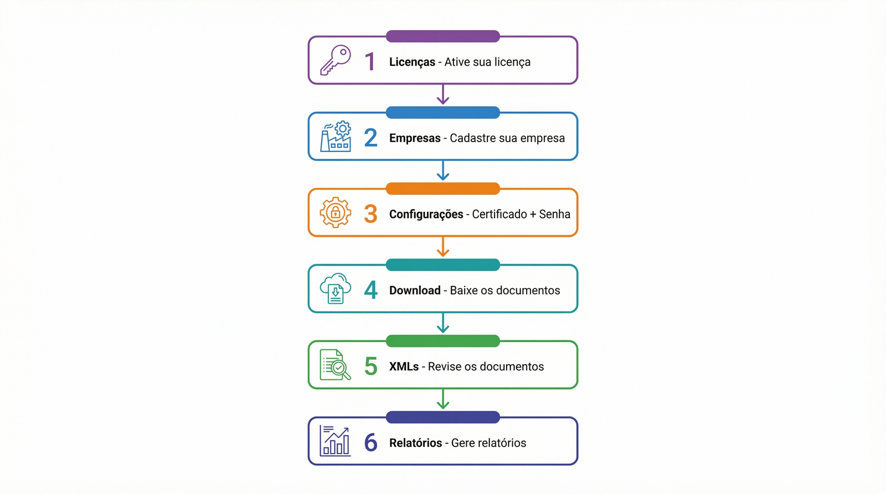
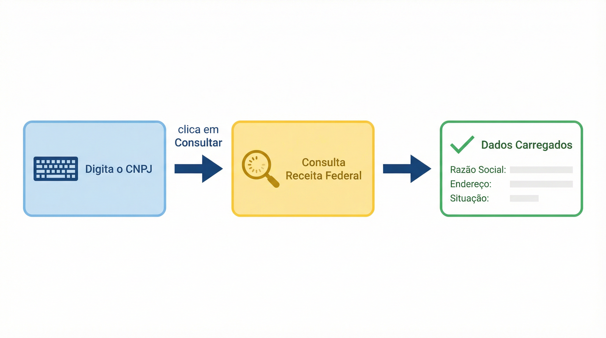
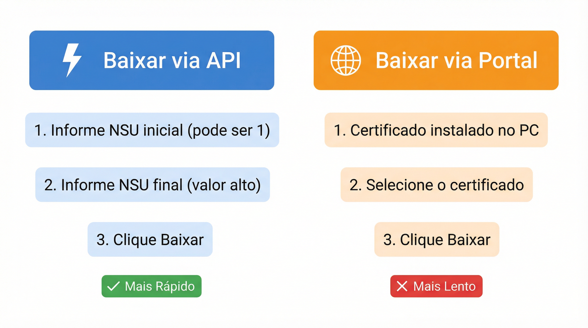
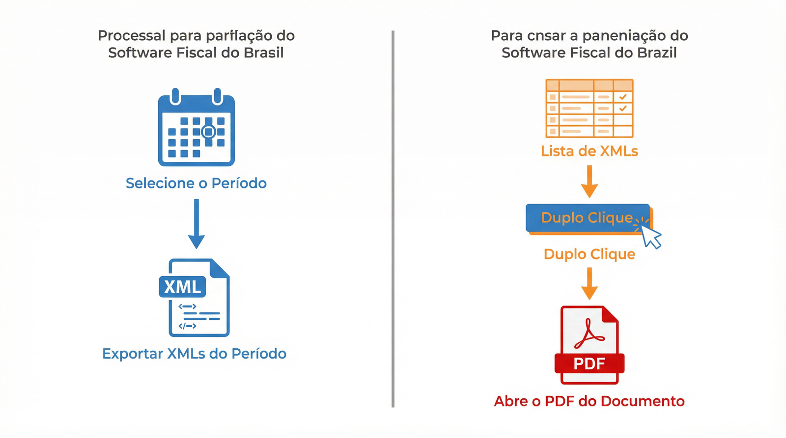
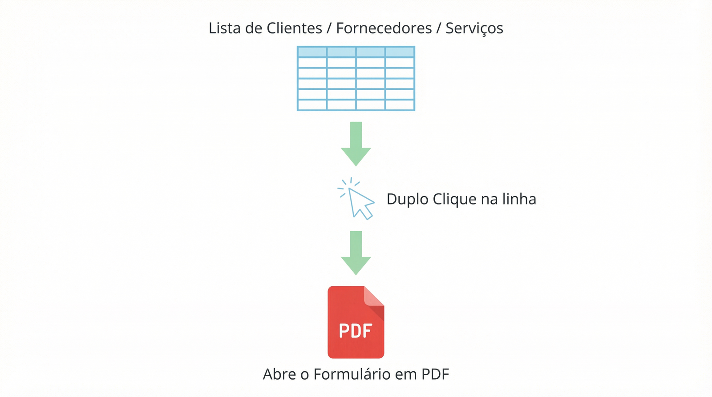

---

> ⚠️ **LEIA COM ATENÇÃO - SEQUÊNCIA RECOMENDADA**
>
> **Bem-vindo ao XML Downloader!**
>
> Este programa foi desenvolvido para automatizar o download de documentos fiscais (NFS-e) de forma inteligente e segura. Antes de começar a usar, siga os passos abaixo rigorosamente nesta ordem:
>
> 1. **Licenças**: Cadastre uma licença (temporária de 7 dias ou adquira uma)
> 2. **Empresas**: Cadastre os dados da sua empresa (Razão Social, CNPJ, UF)
> 3. **Configurações**: Configure o certificado digital e a senha
> 4. **Download**: Realize o primeiro download de documentos
> 5. **XMLs**: Revise os documentos importados
> 6. **Relatórios**: Gere relatórios e exporte em PDF/Excel
>
> **Dica de Ouro:** Pressione a tecla **F1** em qualquer tela do programa para abrir a ajuda contextual detalhada sobre a tela que você está acessando.

---

# Manual Completo do XML Downloader

## Sumário

1. [Visão Geral do Sistema](#1-visão-geral-do-sistema)
2. [Licenças - Ativação e Teste](#2-licenças---ativação-e-teste)
3. [Dashboard - Visão Rápida](#3-dashboard---visão-rápida)
4. [Empresas - Cadastro e Gerenciamento](#4-empresas---cadastro-e-gerenciamento)
5. [Configurações - Certificado e Portal](#5-configurações---certificado-e-portal)
6. [Download - Busca e Importação](#6-download---busca-e-importação)
7. [XMLs - Conferência Operacional](#7-xmls---conferência-operacional)
8. [Relatórios - Análise e Exportação](#8-relatórios---análise-e-exportação)
9. [Limpeza e Backup - Proteção de Dados](#9-limpeza-e-backup---proteção-de-dados)
10. [Manifestação e Logs - Avançado](#10-manifestação-e-logs---avançado)

---

## 1. Visão Geral do Sistema

O XML Downloader é um software especializado projetado para conectar-se automaticamente aos portais de NFS-e das prefeituras, baixar documentos fiscais de forma segura, importar os XMLs em banco de dados local e gerar relatórios analíticos em PDF ou Excel.

O sistema mantém um histórico completo de todas as operações e oferece limpeza e backup automático dos dados.

### Fluxo Recomendado de Primeiro Uso

Siga esta sequência ao usar o programa pela primeira vez:

| Passo | Módulo | O que fazer |
|-------|--------|-------------|
| 1 | **Licenças** | Ative a licença temporária (7 dias) ou adquira uma |
| 2 | **Empresas** | Cadastre os dados da empresa (CNPJ, Razão Social, UF) |
| 3 | **Configurações** | Configure o certificado digital e a senha |
| 4 | **Download** | Realize o primeiro download de documentos |
| 5 | **XMLs** | Revise os documentos importados |
| 6 | **Relatórios** | Gere relatórios e exporte em PDF/Excel |

---

## 2. Licenças - Ativação e Teste

O módulo de licenças gerencia a ativação do software. Aqui você cadastra o comprador, acompanha o período de teste e realiza pagamentos.

### Estados de Licença

| Estado | Descrição |
|--------|-----------|
| **Não Cadastrado** | Nenhuma licença ativa. Acesse este módulo para começar. |
| **Teste Ativo (7 dias)** | Você pode usar todas as funcionalidades durante o período de teste. |
| **Licença Ativa** | Uso sem restrições. |
| **Licença Expirada** | XMLs já baixados continuam disponíveis, mas novos downloads são bloqueados. |

### Como Ativar o Teste de 7 Dias

1. Acesse o módulo **Licenças** no menu lateral
2. Preencha os dados do comprador (nome, e-mail, CPF/CNPJ)
3. Clique em **Ativar Teste**
4. O sistema liberará o uso completo por 7 dias

### Como Adquirir uma Licença

1. No módulo **Licenças**, selecione a quantidade de máquinas
2. O sistema gerará um código Pix para pagamento
3. Realize o pagamento via Pix
4. Clique em **Atualizar Status** para confirmar o pagamento
5. A licença será ativada automaticamente

---

## 3. Dashboard - Visão Rápida

O Dashboard é a tela inicial que oferece uma visão consolidada do estado geral do sistema.

**O que você encontra:**

- **Empresa Ativa**: Mostra qual empresa está selecionada (afeta todos os módulos).
- **Estatísticas Gerais**: Total de empresas e documentos importados.
- **Documentos Recentes**: Lista dos 20 documentos mais recentes.

*Use o Dashboard como ponto de entrada, mas realize as operações nos módulos específicos.*

---

## 4. Empresas - Cadastro e Gerenciamento

Neste módulo você cadastra as empresas que utilizarão o sistema. Cada empresa tem seus próprios documentos e configurações de certificado.

### Como Cadastrar uma Empresa com Consulta Automática de CNPJ

O sistema permite consultar os dados diretamente na Receita Federal, facilitando o preenchimento:

1. Clique em **Nova Empresa**
2. **Passo 1:** Digite apenas o número do **CNPJ** no campo correspondente
3. **Passo 2:** Clique no botão **"Consultar CNPJ"** (ícone de lupa) ao lado do campo
4. **Passo 3:** Aguarde o sistema carregar os dados da Receita Federal
5. Verifique se os campos (Razão Social, Endereço, etc.) foram preenchidos corretamente
6. Selecione a **UF** (Estado) caso não tenha sido preenchida automaticamente
7. Clique em **Salvar** para confirmar o cadastro

### Campos Obrigatórios

| Campo | Descrição |
|-------|-----------|
| **Razão Social** | Nome completo da empresa |
| **CNPJ** | Número do CNPJ (sem máscara) |
| **UF** | Estado onde a empresa está sediada |

### Como Editar ou Excluir

- **Editar**: Selecione a empresa na lista → clique em **Editar** → altere os dados → **Salvar**
- **Excluir**: Selecione a empresa → clique em **Excluir** → confirme. **Atenção:** remove todos os dados associados (documentos, configurações, etc.)

---

## 5. Configurações - Certificado e Portal

Este módulo centraliza as configurações essenciais para o funcionamento do sistema.

> 💡 **IMPORTANTE: O que preencher nesta versão**
>
> Nesta versão do sistema, **você só precisa preencher o Certificado Digital e a Senha**. Todas as outras configurações (Portal, Pastas, etc.) são **opcionais** e o sistema funcionará perfeitamente com os valores padrão.

### Aba Certificado (Obrigatório)

1. Clique em **Procurar** para selecionar o arquivo do certificado
2. Selecione o arquivo **.pfx** ou **.p12** do seu certificado digital
3. Digite a **Senha do Certificado** (fornecida quando você adquiriu o certificado)
4. Clique em **Salvar Certificado**
5. Uma mensagem de sucesso confirmará que o certificado foi salvo

> ⚠️ **Atenção:** Configure o certificado **ANTES** de tentar o primeiro download. Cada empresa deve ter seu próprio certificado.

### Aba Portal (Opcional)

- Escolha entre usar o **Certificado Digital** ou **Credenciais (Login/Senha)**.
- O **Navegador Oculto (Headless)** pode ser ativado para que o navegador funcione em segundo plano (recomendado apenas após testar no modo visível).

---

## 6. Download - Busca e Importação

O módulo principal para buscar documentos no portal da prefeitura. Existem dois métodos de download:

### Método 1: Baixar via API (Recomendado - Mais Rápido)

Este é o método mais eficiente e rápido para baixar documentos.

1. Selecione a **empresa** e o **tipo de documento** (Tomada ou Prestada)
2. No campo **NSU Inicial**, se você não souber qual é, **pode colocar 1**
3. No campo **NSU Final**, coloque um **valor bem alto** (ex: 999999) para que o sistema procure todos os documentos de forma rápida
4. Clique em **Baixar via API**

> **O que é NSU?** É o Número Sequencial Único que identifica cada documento no portal. Se você não sabe qual NSU usar, coloque 1 no inicial e um número alto no final. O sistema encontrará tudo rapidamente.

### Método 2: Baixar via Portal (Alternativo - Mais Demorado)

Use este método como alternativa quando a API não estiver disponível.

> ⚠️ **Pré-requisito:** O certificado digital precisa estar **instalado no computador** (Windows) para usar este método.

1. Selecione a **empresa** e o **tipo de documento**
2. Informe o **período** (Data Inicial e Final)
3. Clique em **Baixar via Portal**
4. A única ação necessária é **selecionar o certificado** na janela que aparecer — o sistema faz o restante automaticamente
5. *Este processo é mais demorado que a API, pois simula a navegação humana no portal.*

### Acompanhamento do Download

| Elemento | Descrição |
|----------|-----------|
| **Barra de Progresso** | Mostra o percentual de conclusão (0-100%) |
| **Caixas de Status** | Indicam em qual etapa o sistema está |
| **Grade de Resultados** | Resumo do job (documentos baixados, importados, erros) |

---

## 7. XMLs - Conferência Operacional

Tela destinada à conferência do dia a dia dos documentos importados.

### Como Exportar XMLs de um Período

O sistema permite exportar todos os arquivos XML de um determinado período de uma só vez:

1. Selecione a empresa e o tipo de documento
2. Selecione o **período desejado** (Data Inicial e Final)
3. Clique no botão **"Exportar XMLs"**
4. O sistema exportará todos os arquivos do período selecionado para a pasta escolhida

### Como Visualizar o PDF do Documento

Para ver o documento formatado (DANFE/Formulário):

1. Encontre o documento desejado na lista
2. Dê um **Duplo Clique** na linha do documento
3. O sistema abrirá automaticamente o arquivo PDF com o formulário completo da nota

### Filtros Disponíveis

| Filtro | Descrição |
|--------|-----------|
| **Período** | Filtra documentos por data de emissão |
| **Status** | Filtra por status (Ativo, Cancelado, etc.) |
| **Tipo** | Filtra por tipo (Tomada ou Prestada) |
| **Busca Inteligente** | Busca por chave, número, emitente, destinatário ou CNPJ |

---

## 8. Relatórios - Análise e Exportação

Diferente da tela de XMLs, aqui os dados são apresentados de forma analítica e prontos para exportação.

### Visualização Rápida de Documentos (Duplo Clique)

Para conferir um documento diretamente da tela de relatórios:

- Disponível nas listas de: **Clientes**, **Fornecedores** e **Serviços**
- Basta dar um **Duplo Clique** na linha desejada
- O sistema abrirá automaticamente o documento formatado em PDF

### Abas Disponíveis

| Aba | Descrição |
|-----|-----------|
| **Financeiro** | Resumo financeiro com totalizações por período |
| **Clientes** | Análise de documentos por cliente (NFS-e Prestada) |
| **Fornecedores** | Análise de documentos por fornecedor (NFS-e Tomada) |
| **Serviços** | Quantidade e valor por tipo de serviço |
| **Impostos** | Resumo de impostos retidos/devidos |
| **Cancelamentos** | Documentos cancelados no período |

### Como Exportar

**Exportar para PDF:**
1. Configure os filtros (empresa, tipo, período)
2. Clique em **Exportar PDF**
3. Escolha o local para salvar
4. O PDF será gerado com cabeçalho da empresa, período e totalizações

**Exportar para Excel:**
1. Configure os filtros desejados
2. Clique em **Exportar Excel**
3. Escolha o local para salvar
4. O arquivo .xlsx será gerado com todos os dados desagrupados (uma linha por documento)

---

## 9. Limpeza e Backup - Proteção de Dados

Ferramentas para manter o sistema rápido e seus dados seguros.

| Função | Descrição |
|--------|-----------|
| **Limpeza** | Remove cache, arquivos temporários e logs antigos |
| **Backup** | Cria um arquivo .zip com todos os seus dados |
| **Restauração** | Recupera dados de um backup anterior (sobrescreve os dados atuais) |

> ⭐ **Recomendação:** Faça backup regularmente, especialmente antes de atualizações ou limpezas.

---

## 10. Manifestação e Logs - Avançado

### Manifestação

Acompanhe filas e eventos ligados à manifestação de NF-e. Útil para empresas que precisam comunicar à Receita Federal sua posição sobre um documento recebido.

### Logs

Registros técnicos de tudo que acontece no sistema.

- Abra quando um download falhar
- Procure por mensagens de **ERROR** para identificar o problema
- Copie a mensagem de erro completa ao solicitar suporte
- Use **Ctrl+F** para buscar palavras-chave no arquivo de log

---

*Manual gerado por Manus AI — Abril 2026*
